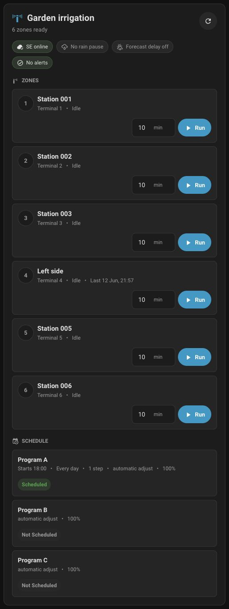

# Rain Bird IQ4 for Home Assistant

Custom Home Assistant integration for Rain Bird controllers that were migrated to the Rain Bird 2.0 / IQ4 cloud.

The built-in Home Assistant `rainbird` integration talks to the old local LNK WiFi API. Rain Bird 2.0 / IQ4 firmware can move schedule and controller management into the IQ4 cloud, and Home Assistant's official documentation lists that path as incompatible with the local integration. This custom integration talks to the IQ4 cloud API instead.

This project is unofficial and is not affiliated with Rain Bird.

## What Works

- Sign in with a Rain Bird 2.0 / IQ4 account.
- Discover IQ4 sites, controllers, and stations.
- Create one Home Assistant device per controller.
- Create a connectivity binary sensor per controller.
- Create a rain delay number per controller.
- Create a switch per station.
- Start a station for a default duration by turning on its switch.
- Stop a station by turning off its switch.
- Call services to start stations, stop stations, stop all irrigation on a controller, and set rain delay.

## Important Limitations

- This uses an undocumented IQ4 cloud API observed from the IQ4 web app. Rain Bird can change it at any time.
- It needs internet access and your Rain Bird account credentials. It is not local control.
- Station switch state is best-effort. The integration tracks runs started from Home Assistant and polls controller data, but IQ4 may not expose every manual run state consistently.
- Rain Bird login can sometimes be protected by an AWS WAF browser challenge. The recommended setup method is **Browser token**, where a helper page lets your normal browser sign in and send the token back to Home Assistant.
- The password requested by this integration is your Rain Bird 2.0 / IQ4 account password, not the 6 digit controller PIN used by the mobile app.

## Install With HACS

1. Open Home Assistant.
2. Go to **HACS**.
3. Open the three-dot menu and choose **Custom repositories**.
4. Add this repository URL:

   ```text
   https://github.com/andreypopov/rainbird_iq4
   ```

5. Select category **Integration**.
6. Click **Add**.
7. Search HACS for **Rain Bird IQ4**.
8. Download it.
9. Restart Home Assistant.

The integration ships Home Assistant brand assets in `custom_components/rainbird_iq4/brand/`, so recent Home Assistant versions can show the Rain Bird icon/logo for the custom integration after installation.

## Manual Install

1. Download this repository.
2. Copy this folder:

   ```text
   custom_components/rainbird_iq4
   ```

   into your Home Assistant config directory:

   ```text
   /config/custom_components/rainbird_iq4
   ```

3. Restart Home Assistant.

## Add The Integration

1. In Home Assistant, go to **Settings -> Devices & services**.
2. Click **Add integration**.
3. Search for **Rain Bird IQ4**.
4. Choose **Browser token**.
5. Open the **Rain Bird token helper** link shown by Home Assistant.
6. Drag the **Send Rain Bird token to HA** bookmarklet from the helper page to your browser bookmarks bar.
7. Click **Open Rain Bird login** on the helper page.
8. Sign in with your Rain Bird 2.0 / IQ4 account. This is not the 6 digit controller PIN used by the mobile app.
9. Let Rain Bird finish loading, even if it quickly redirects away from the blank auth page.
10. Click the **Send Rain Bird token to HA** bookmarklet while you are on the Rain Bird web app.
11. Return to the Home Assistant setup dialog and click **Submit**. You can leave the token field empty.

The helper is there because Rain Bird often redirects away from the token URL too quickly to copy it manually.

Fallback: if you do catch the URL, paste the full address into the Home Assistant form. It usually starts with:

   ```text
   https://iq4.rainbird.com/auth.html#
   ```

You can also paste only the `access_token` value if you know how to extract it.

After setup, each IQ4 controller should appear as a device with its stations and rain delay control.

### Username And Password Setup

The integration still supports direct username/password setup, but Rain Bird may block server-side login with an AWS WAF browser challenge. If that happens, Home Assistant will ask you to reconfigure the integration with a browser token.

### Updating An Expired Token

Rain Bird browser tokens can expire. When that happens, Home Assistant marks the integration as needing attention:

1. Open **Settings -> Devices & services**.
2. Open **Rain Bird IQ4**.
3. Click **Reconfigure**.
4. Open the token helper link.
5. Use the bookmarklet on the Rain Bird web app.
6. Return to the Home Assistant dialog and click **Submit**.

Home Assistant stores the token in the integration config entry, the same place it stores other integration credentials.

## Dashboard Card

This integration includes a Lovelace custom card for day-to-day irrigation control.



The card can:

- Auto-discover Rain Bird IQ4 zone sensors from newer integrations.
- Auto-discover legacy station switches from this integration as a fallback.
- Hide the controller picker when there is only one controller.
- Set a compact run duration per zone right next to its Run button.
- Start or stop individual zones.
- Show Stop all only while one or more zones are running.
- Show controller connection, rain pause, forecast delay, alerts, and program schedule status.

### Add The Card Resource

After installing the integration and restarting Home Assistant:

1. Go to **Settings -> Dashboards**.
2. Open the three-dot menu.
3. Choose **Resources**.
4. Click **Add resource**.
5. Use this URL:

   ```text
   /rainbird_iq4_static/rainbird-iq4-card.js
   ```

6. Choose resource type **JavaScript module**.
7. Refresh the browser tab.

If your Home Assistant uses YAML-managed Lovelace resources (`lovelace: resource_mode: yaml`), add the resource in `configuration.yaml` instead:

```yaml
lovelace:
  resource_mode: yaml
  resources:
    - url: /rainbird_iq4_static/rainbird-iq4-card.js
      type: module
```

For manual installs where the integration static path is not available yet, copy `custom_components/rainbird_iq4/www/rainbird-iq4-card.js` to `/config/www/rainbird-iq4-card.js` and use `/local/rainbird-iq4-card.js` as the resource URL.

### Add The Card

Use this manual card YAML:

```yaml
type: custom:rainbird-iq4-card
title: Garden irrigation
auto: true
default_duration: 10
```

`default_duration` is the initial minute value shown for each zone. You can change the minutes per zone directly on the card before starting it.

The card auto-discovers Rain Bird IQ4 zone sensors first. If none are present, it falls back to legacy station switches created by this integration. For a fixed list of zones, use:

```yaml
type: custom:rainbird-iq4-card
title: Front lawn
auto: false
default_duration: 8
entities:
  - sensor.front_lawn_zone_1
  - sensor.front_lawn_zone_2
```

For multiple controllers you can select the default controller:

```yaml
type: custom:rainbird-iq4-card
title: Irrigation
auto: true
controller_id: 1234
controller_names:
  "1234": Front garden
  "5678": Back garden
```

## Options

Open the integration options from **Settings -> Devices & services -> Rain Bird IQ4 -> Configure**.

- **Default station duration**: minutes used when you turn on a station switch. Default: `6`.
- **Cloud polling interval**: minutes between IQ4 refreshes. Default: `5`.

## Services

The integration registers these services under the `rainbird_iq4` domain.

### `rainbird_iq4.start_station`

Start one or more stations.

```yaml
service: rainbird_iq4.start_station
data:
  station_id: 12345
  duration: 10
```

Multiple stations:

```yaml
service: rainbird_iq4.start_station
data:
  station_id:
    - 12345
    - 12346
  duration: 8
  is_group_start: false
```

`duration` is in minutes.

### `rainbird_iq4.stop_station`

Stop one or more stations.

```yaml
service: rainbird_iq4.stop_station
data:
  station_id: 12345
```

### `rainbird_iq4.stop_all`

Stop all irrigation for one or more controllers.

```yaml
service: rainbird_iq4.stop_all
data:
  controller_id: 1234
```

### `rainbird_iq4.set_rain_delay`

Set controller rain delay in days.

```yaml
service: rainbird_iq4.set_rain_delay
data:
  controller_id: 1234
  days: 2
```

## Finding Controller And Station IDs

Open the entity details in Home Assistant. Station switches expose these attributes:

- `station_id`
- `controller_id`
- `terminal`
- `landscape_type`
- `sprinkler_type`

The rain delay number and connection binary sensor belong to the controller device.

Rain delay is exposed as a standard Home Assistant number entity and service for automations or rare manual overrides. The bundled card keeps it out of the main day-to-day controls so rain-sensor behavior and manual station starts stay clear.

## Troubleshooting

### Failed to authenticate

Check that you are using the Rain Bird account username and password for the Rain Bird 2.0 / IQ4 app. Do not enter the controller PIN.

### WAF challenge

Rain Bird sometimes protects IQ4 login with a browser JavaScript challenge. Home Assistant cannot and should not solve that challenge server-side. Use **Browser token** setup instead: your browser completes the Rain Bird login, the helper captures the resulting `access_token`, and Home Assistant uses that token for API calls.

### No stations appear

Check the Home Assistant log for `rainbird_iq4`. The account may not have access to the controller, or Rain Bird may have changed the station endpoint.

### Switch turns off too early or does not reflect the app

Station state is best-effort. Home Assistant tracks station runs it starts itself. Manual runs started from the Rain Bird app may not always appear as an active switch.

## Background

Useful references:

- Home Assistant Rain Bird integration docs: https://www.home-assistant.io/integrations/rainbird/
- Rain Bird IQ4 product page: https://www.rainbird.com/usa/iq4-main
- Rain Bird IQ4 manual operations page: https://www.rainbird.com/professionals/iq4-manual-operations
- IQ4 API research CLI: https://github.com/nickustinov/rainbird-iq4-cli

## Development

This repository is intentionally lightweight. The integration uses Home Assistant's built-in `aiohttp`; there are no third-party Python requirements.

Run a syntax check:

```bash
python -m compileall custom_components/rainbird_iq4
```

## License

MIT
